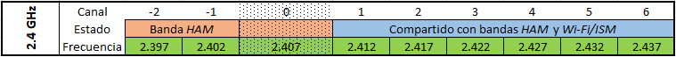

======================
Frecuencias y canales
======================

Las frecuencias y canales disponibles para la red AREDN |trade| se muestran a continuación.

**2.4 GHz**

**3.4 GHz**

.. image:: _images/3.4ghz.png
   :alt: 3.4 GHz Channels
   :align: center

**5.8 GHz**

.. image:: _images/5.8ghz.png
   :alt: 5.8 GHz Channels
   :align: center

.. |trade|  unicode:: U+00AE .. Registered Trademark SIGN
   :ltrim:
